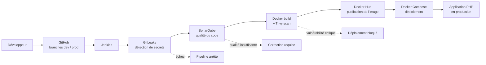

# Projet PHP : Pipeline CI/CD complet (approche DevOps)

Application PHP minimale servant de support à la mise en place d'un **pipeline CI/CD complet** : de la modification du code jusqu'au déploiement automatique en production, avec des contrôles de sécurité et de qualité à chaque étape.

> Projet réalisé dans le cadre de l'**Atelier 1** de la formation DevOps.

---

## Sommaire

1. [Objectif du projet](#1-objectif-du-projet)
2. [Principes DevOps appliqués](#2-principes-devops-appliqués)
3. [Technologies utilisées](#3-technologies-utilisées)
4. [Architecture du pipeline](#4-architecture-du-pipeline)
5. [Structure du dépôt](#5-structure-du-dépôt)
6. [Stratégie de branches](#6-stratégie-de-branches)
7. [Prérequis](#7-prérequis)
8. [Lancer l'application en local](#8-lancer-lapplication-en-local)
9. [Infrastructure CI/CD (Jenkins et SonarQube)](#9-infrastructure-cicd-jenkins-et-sonarqube)
10. [Étapes du pipeline](#10-étapes-du-pipeline)
11. [Sécurité et gestion des secrets](#11-sécurité-et-gestion-des-secrets)
12. [Déploiement](#12-déploiement)
13. [Dépannage](#13-dépannage)
14. [Auteur](#14-auteur)

---

## 1. Objectif du projet

Mettre en place une chaîne d'automatisation qui, à chaque modification du code :

- récupère automatiquement le projet depuis GitHub ;
- vérifie qu'aucun secret (mot de passe, token, clé API) n'est exposé ;
- analyse la qualité du code (bugs, vulnérabilités, mauvaises pratiques) ;
- construit une image Docker et la scanne à la recherche de vulnérabilités ;
- publie l'image validée sur Docker Hub ;
- déploie automatiquement l'application avec Docker Compose.

Résultat attendu : une **livraison rapide, automatisée et sécurisée**.

---

## 2. Principes DevOps appliqués

| Principe | Application dans ce projet |
|---|---|
| **Intégration continue (CI)** | Chaque modification du code déclenche automatiquement les étapes de vérification (sécurité, qualité, build). |
| **Livraison / déploiement continu (CD)** | Une image validée est publiée puis déployée sans intervention manuelle. |
| **Automatisation** | Le pipeline est décrit dans un fichier (`Jenkinsfile`), pas exécuté à la main. |
| **Infrastructure as Code (IaC)** | Jenkins, SonarQube et l'application sont définis dans des fichiers (`Dockerfile`, `docker-compose.yml`) versionnés. |
| **Conteneurisation** | Toutes les briques tournent dans des containers Docker : environnement identique partout. |
| **Shift-left security (DevSecOps)** | La sécurité est vérifiée tôt : détection de secrets (GitLeaks), analyse statique (SonarQube), scan de l'image (Trivy). |
| **Quality gates** | Le pipeline s'arrête si les seuils de sécurité ou de qualité ne sont pas respectés. |
| **Moindre privilège** | Les tokens (GitHub, SonarQube, Docker Hub) ont uniquement les droits nécessaires. |
| **Gestion de versions** | Tout le code est versionné avec Git/GitHub, avec une séparation `dev` / `prod`. |
| **Reproductibilité** | Un seul `docker compose up` suffit pour recréer l'infrastructure. |
| **Feedback rapide** | En cas d'échec, le pipeline signale immédiatement l'étape et la cause du problème. |

---

## 3. Technologies utilisées

| Outil | Rôle |
|---|---|
| **GitHub** | Hébergement et gestion du code source (Git). |
| **Jenkins** | Serveur d'automatisation qui orchestre le pipeline CI/CD. |
| **GitLeaks** | Détection des secrets exposés dans le dépôt. |
| **SonarQube** | Analyse statique de la qualité et de la sécurité du code. |
| **Trivy** | Scan des vulnérabilités (image Docker, dépendances, fichiers). |
| **Docker** | Conteneurisation de l'application et des outils. |
| **Docker Hub** | Registre où sont stockées les images Docker validées. |
| **Docker Compose** | Définition et lancement des containers à partir d'un fichier YAML. |
| **PHP 8.2 + Apache** | Application web (image `php:8.2-apache`). |
| **PostgreSQL 15** | Base de données de SonarQube. |

---

## 4. Architecture du pipeline



---

## 5. Structure du dépôt

```
projet-php/
├── src/
│   └── index.php        # Code de l'application PHP
├── Dockerfile           # Image de l'application (PHP + Apache)
├── .dockerignore        # Fichiers exclus de l'image Docker
├── .gitignore           # Fichiers exclus de Git
├── Jenkinsfile          # Définition du pipeline CI/CD (étape 7 de l'atelier)
├── docker-compose.yml   # Déploiement de l'application (étape 8 de l'atelier)
└── README.md            # Ce fichier
```

> Les fichiers `Jenkinsfile` et `docker-compose.yml` sont ajoutés au fur et à mesure de l'avancement de l'atelier.

L'infrastructure CI/CD (Jenkins, SonarQube, PostgreSQL) est dans un dossier séparé, `atelier-cicd/` :

```
atelier-cicd/
├── docker-compose.yml   # Jenkins + SonarQube + PostgreSQL
└── jenkins/
    └── Dockerfile       # Jenkins avec le client Docker
```

---

## 6. Stratégie de branches

| Branche | Rôle |
|---|---|
| `dev` | Développement : les modifications sont d'abord poussées ici. |
| `prod` | Production : contient le code validé, prêt à être déployé. |

Flux de travail :

1. Le développeur travaille et pousse sur `dev`.
2. Après validation, `dev` est fusionnée dans `prod` (Pull Request recommandée).
3. Le déploiement en production est déclenché à partir de `prod`.

---

## 7. Prérequis

- **Docker Desktop** (inclut Docker Compose), avec WSL2 activé sous Windows
- **Git**
- Un compte **GitHub** et un compte **Docker Hub**
- Au moins **8 Go de RAM** (SonarQube est gourmand) et environ 20 Go d'espace disque libre
- Un éditeur de code (ex. Visual Studio Code)

Vérification de l'installation :

```bash
docker --version
docker compose version
git --version
```

---

## 8. Lancer l'application en local

```bash
# 1. Cloner le dépôt
git clone https://github.com/TON_USERNAME/projet-php.git
cd projet-php

# 2. Construire l'image
docker build -t projet-php:test .

# 3. Lancer le container
docker run -d --name test-php -p 8081:80 projet-php:test
```

Ouvrir **http://localhost:8081** : la page « Bonjour DevOps ! » s'affiche.
Variante : **http://localhost:8081/?nom=Prenom**

Arrêter et nettoyer :

```bash
docker stop test-php
docker rm test-php
```

---

## 9. Infrastructure CI/CD (Jenkins et SonarQube)

Depuis le dossier `atelier-cicd/` :

```bash
# Windows (Docker Desktop / WSL2) : réglage requis par SonarQube (temporaire)
wsl -d docker-desktop sysctl -w vm.max_map_count=262144

# Lancer Jenkins, SonarQube et PostgreSQL
docker compose up -d --build
```

| Service | URL | Remarque |
|---|---|---|
| Jenkins | http://localhost:8080 | Mot de passe initial : `docker exec jenkins cat /var/jenkins_home/secrets/initialAdminPassword` |
| SonarQube | http://localhost:9000 | Identifiants par défaut `admin` / `admin` (à changer au premier login) |

Jenkins utilise le moteur Docker de la machine hôte grâce au montage de `/var/run/docker.sock` (principe « Docker outside of Docker »).

---

## 10. Étapes du pipeline

| # | Étape | Outil | Condition d'échec |
|---|---|---|---|
| 1 | Récupération du code | Jenkins + token GitHub | Dépôt inaccessible |
| 2 | Détection de secrets | GitLeaks | Secret détecté : pipeline arrêté |
| 3 | Analyse de la qualité du code | SonarQube | Quality Gate non respectée : correction requise |
| 4 | Construction de l'image | Docker | Erreur de build |
| 5 | Scan de sécurité de l'image | Trivy | Vulnérabilité critique : déploiement bloqué |
| 6 | Publication de l'image | Docker Hub | Échec d'authentification ou de push |
| 7 | Déploiement | Docker Compose | Échec du démarrage du container |

---

## 11. Sécurité et gestion des secrets

- **Aucun secret n'est écrit dans le code ni dans le `Jenkinsfile`.**
- Les tokens sont stockés dans les **Credentials Jenkins** :
  - token GitHub (**fine-grained**, lecture seule sur ce dépôt uniquement) ;
  - token SonarQube (envoi des analyses) ;
  - token Docker Hub (publication des images).
- Le fichier `.env` est exclu de Git via `.gitignore`.
- **GitLeaks** vérifie à chaque exécution qu'aucun secret n'est exposé.
- **Trivy** bloque le déploiement en cas de vulnérabilité critique.
- Les mots de passe par défaut utilisés dans l'atelier (ex. base de données SonarQube) sont **uniquement destinés à un environnement local de formation** et ne doivent jamais être utilisés en production.
- L'accès au `docker.sock` donne à Jenkins un contrôle total sur Docker : acceptable pour un atelier, à encadrer strictement en production.

---

## 12. Déploiement

Le déploiement est réalisé avec **Docker Compose** à partir de l'image publiée sur Docker Hub.

Exemple de `docker-compose.yml` (sera finalisé à l'étape 8) :

```yaml
services:
  app:
    image: TON_USER_DOCKERHUB/projet-php:latest
    container_name: projet-php
    restart: unless-stopped
    ports:
      - "80:80"
```

Commande de déploiement :

```bash
docker compose pull
docker compose up -d
```

---

## 13. Dépannage

| Problème | Solution |
|---|---|
| SonarQube ne démarre pas | Relancer `wsl -d docker-desktop sysctl -w vm.max_map_count=262144`, puis `docker compose restart sonarqube` |
| `docker: command not found` dans Jenkins | Vérifier le `jenkins/Dockerfile` et reconstruire : `docker compose up -d --build` |
| Jenkins ne peut pas utiliser Docker | Vérifier le montage `/var/run/docker.sock` et tester `docker exec jenkins docker ps` |
| Port déjà utilisé | Changer le port de gauche dans `ports` (ex. `8082:80`) |
| La machine ralentit | Fermer les applications inutiles, ne lancer SonarQube que pour l'analyse |
| Suivre les logs d'un service | `docker logs -f nom_du_container` |

---

## 14. Auteur

**Ton Nom**
Formation DevOps : Atelier 1 (pipeline CI/CD pour un projet PHP)
GitHub : [@TON_USERNAME](https://github.com/TON_USERNAME)
